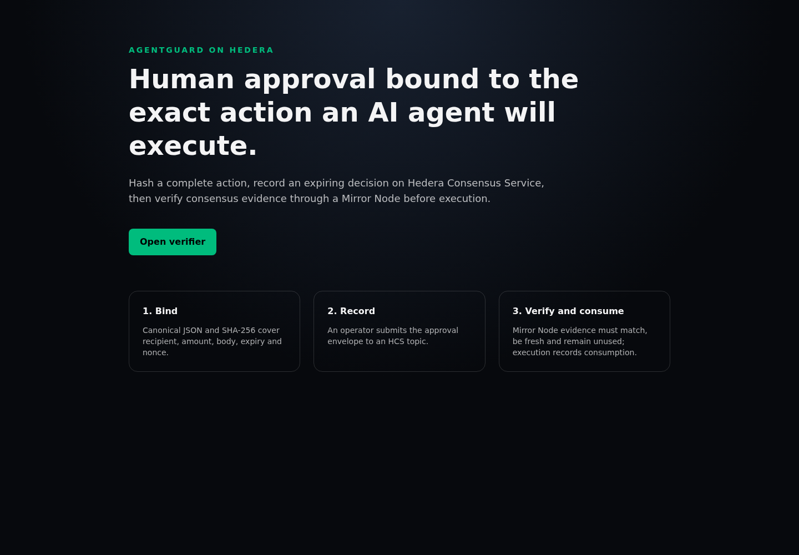
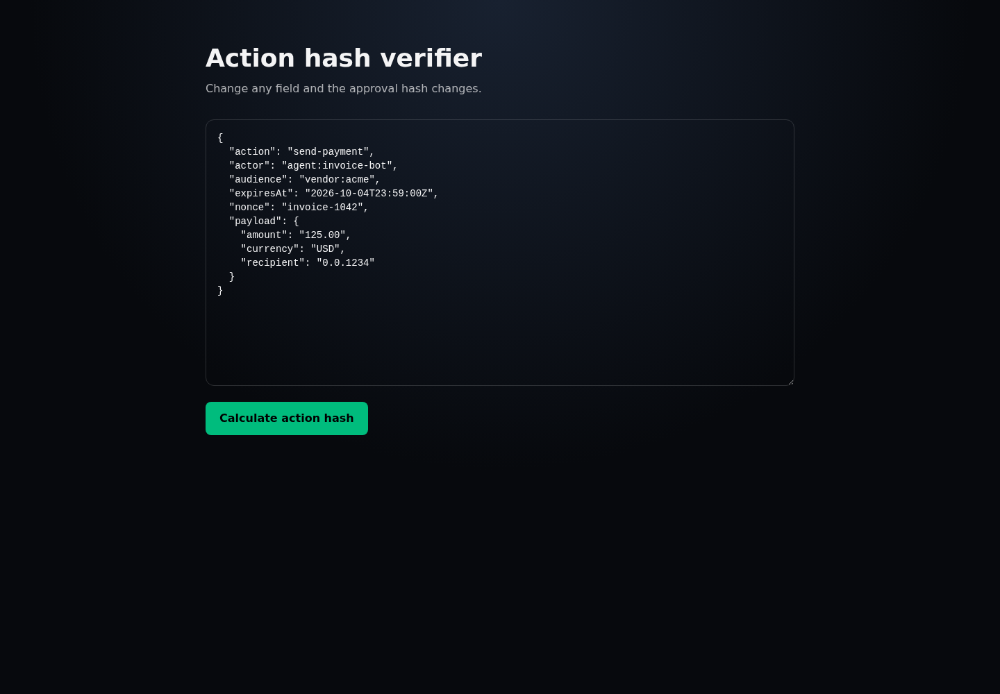

# AgentGuard demo

This walkthrough takes about two minutes and shows why Hedera is part of the execution gate rather than an after-the-fact log.

## 1. Scaffold and run

```bash
npx create-scaffold-hbar@latest my-agentguard --template Drill23/agentguard-hedera
cd my-agentguard
cp packages/nextjs/.env.example packages/nextjs/.env
npm install
npm run next:dev
```

Open `http://localhost:3000`.



## 2. Show exact-action binding

Open `/verify`. Calculate the sample action hash, then change one material field such as `payload.amount`, `audience`, or `payload.recipient` and calculate it again. The hash changes because the approval covers the complete canonical action, not a loose description.



The automated test for this property is in `packages/nextjs/tests/agentguard.test.ts`.

## 3. Show consensus evidence

Open the verified testnet topic:

- [HCS topic 0.0.10652713 on HashScan](https://hashscan.io/testnet/topic/0.0.10652713)
- [Fixture message transaction](https://hashscan.io/testnet/transaction/0.0.10650574-1790018075-281060274)
- [Mirror Node message API](https://testnet.mirrornode.hedera.com/api/v1/topics/0.0.10652713/messages)

The message is explicitly labeled `agentguard.test-fixture`, has `fixture: true`, and names `AgentGuard test fixture` as its source. It proves the HCS and Mirror Node path without claiming a human decision that did not happen.

## 4. Explain the execution gate

`POST /api/agentguard/verify` fetches Mirror Node messages in consensus order and fails closed unless it finds exactly one fresh decision matching the action hash and nonce. A modified, expired, rejected, ambiguous, or already consumed action is blocked.

`POST /api/agentguard/consume` verifies again and submits a consumption envelope to HCS. The same decision cannot silently authorize a second execution. The production handoff is the point immediately after the consumption transaction succeeds.

## 5. Run the gate

```bash
npm run next:check-types
npm run lint
npm test
npm run next:build
```

The repository CI runs the same checks on every push and pull request.

## Suggested narration

> AgentGuard binds human approval to the exact action an AI agent will execute. It canonicalizes the full payload and hashes it, so changing an amount, recipient, audience, expiry, or nonce invalidates the approval. The decision is submitted to Hedera Consensus Service, and the executor reads consensus evidence through a Mirror Node. Execution fails closed unless there is exactly one matching, fresh and unused decision. Immediately before the side effect, AgentGuard records consumption on HCS, preventing silent replay. Hedera is therefore the shared ordering and evidence layer for the gate, not decorative logging.
